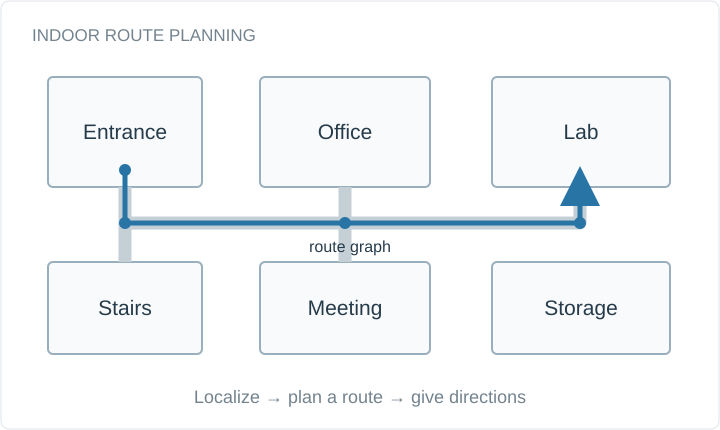

# indoor-navigation

Dijkstra route planning for a weighted indoor graph. This reference component validates routes and distances and uses predecessor links to avoid copying paths during search.



## Quick start

Requires Python 3.10+ and the standard library. No package installation or network access is needed.

```sh
git clone https://github.com/bhanuprakashvangala/indoor-navigation.git
cd indoor-navigation
python navigation.py data/floor.json entrance lab
python -m unittest discover -s tests -v
```

## Scope

This September 2026 companion implementation covers route planning only. It does not contain the original BLE localization, Kotlin app, or Raspberry Pi integration.

The overview is a conceptual diagram. Example inputs are synthetic. [Project background](https://github.com/bhanuprakashvangala/portfolio-artifacts/tree/main/projects/indoor-nav) and [input formats](https://github.com/bhanuprakashvangala/portfolio-artifacts/blob/main/examples/README.md) are available in the portfolio artifact collection.

## Implementation

The implementation is in [navigation.py](navigation.py). It exposes a reusable Python interface in addition to the command-line entry point. Tests cover the core behavior, invalid inputs, and boundary cases. New examples are maintained independently of the original research repositories.
